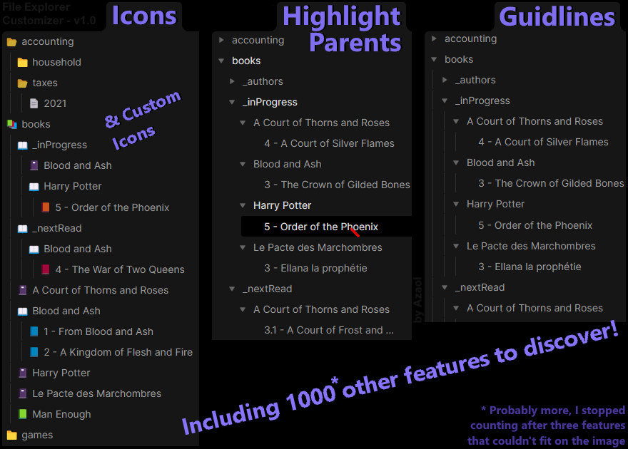

# File Explorer Customizer

Personalize the File Explorer on any device and make it your own!

Have you ever wonder what Folder a File was in? Dreamed of having icons for all files of a folder without having to copy/paste the emoji in the File title? Well, this plugin is for you! It is actually possible to customize the way the File Explorer, placed on the left side of Obsidian by default, appears and behaves! Have a look at the available features to give you an idea of why this plugin may be for you or not. If you're still not sure after looking at the list, or if you don't want to read too much, just download, enable and head to the settings!

There, everything is explained and you also have the possibility (currently on desktop only) to see what the settings does live by hitting a magic preview button that moves the setting modal to the right and reveal the File Explorer!

By default, the plugin will:
- **Set icons for** Files, folded Folders and open Folders. *Those can be **changed** or removed*.
- **Allow you to pick your own icons** for specific Folders, or for the content of a specific folder.
- **Hide a Folder** while keeping access to its content through links, quick switcher, other panes and other plugins! *See Custom Icons in the settings*.
- **Let you remove the default arrow indicator** for folded Folders. If you use different icons for open and folded Folders, you may want to get rid of the arrows for a lighter visual. *This can be turned back on*.
- **Add a Collapsible Outline!** A line is added on the left side of the content of each folder, so you can identify which Folder a File or Folder is in. *This can be toggled off*.
- **Make the Collapsible Outline Lighter** when your mouse cursor is hover any child document, or when you are holding an element to be moved using drag and drop on a tactile device. *This can be turned off*.
- **Highlight the names of all parent directories** when your mouse cursor is hover any child document, or when you are holding an element to be moved using drag and drop on a tactile device. *This can be turned off*.
- **Hide the Vault title!** If you don't want it there, you can now hide it. *This can be reversed to the default look, or set to Emphasize to make it bold.*
- **Not enable custom icons to non-Markdown files**, because having two icons might be much. Don't worry, *this can be turned back on*.
- **Settings modal reminds your position** so you're bck to where you let things if you close the modal or swap to another settings for any reason!

Install the plugin to give it a try, and if you don't like it, let me know why!
